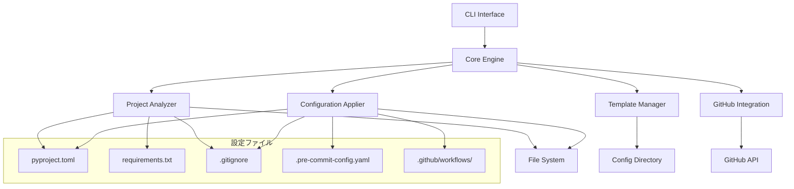

# 設計文書

## 概要

Secuority CLIは、Pythonプロジェクトのコード品質とセキュリティ設定を自動化・標準化するモジュラー設計のコマンドラインツールです。このツールは、プロジェクト分析、設定テンプレート管理、安全な設定適用、GitHub統合の4つの主要コンポーネントで構成されています。

## アーキテクチャ

### 高レベルアーキテクチャ



### コンポーネント構造

```
secuority/
├── cli/                    # CLIインターフェース
│   ├── __init__.py
│   ├── main.py            # メインエントリーポイント
│   ├── commands/          # コマンド実装
│   │   ├── check.py
│   │   ├── apply.py
│   │   ├── template.py
│   │   └── init.py
├── core/                  # コアエンジン
│   ├── __init__.py
│   ├── analyzer.py        # プロジェクト分析
│   ├── applier.py         # 設定適用
│   ├── template_manager.py # テンプレート管理
│   └── github_client.py   # GitHub統合
├── models/                # データモデル
│   ├── __init__.py
│   ├── project.py         # プロジェクト状態
│   ├── config.py          # 設定モデル
│   └── report.py          # レポートモデル
├── templates/             # デフォルトテンプレート
│   ├── pyproject.toml.template
│   ├── .gitignore.template
│   └── .pre-commit-config.yaml.template
└── utils/                 # ユーティリティ
    ├── __init__.py
    ├── file_ops.py        # ファイル操作
    ├── diff.py            # 差分表示
    └── validation.py      # 設定検証
```

## コンポーネントとインターフェース

### 1. CLI Interface

**責任**: ユーザーコマンドの解析と実行

```python
# cli/main.py
class SecuorityCLI:
    def __init__(self):
        self.core_engine = CoreEngine()
    
    def check(self, verbose: bool = False) -> None
    def apply(self, dry_run: bool = False, force: bool = False) -> None
    def template_list() -> None
    def template_update() -> None
    def init() -> None
```

**主要機能**:
- コマンドライン引数の解析
- 適切なコアエンジンメソッドの呼び出し
- ユーザーインタラクション（確認プロンプト、差分表示）
- エラーハンドリングと終了コード管理

### 2. Core Engine

**責任**: ビジネスロジックの調整と実行

```python
# core/analyzer.py
class ProjectAnalyzer:
    def analyze_project(self, project_path: Path) -> ProjectState
    def detect_configuration_files(self, project_path: Path) -> Dict[str, Path]
    def analyze_dependencies(self, project_path: Path) -> DependencyAnalysis
    def check_security_tools(self, project_path: Path) -> SecurityToolsStatus
    def analyze_ci_setup(self, project_path: Path) -> CIAnalysis

# core/applier.py
class ConfigurationApplier:
    def apply_changes(self, changes: List[ConfigChange], dry_run: bool) -> ApplyResult
    def create_backup(self, file_path: Path) -> Path
    def merge_configurations(self, existing: Dict, template: Dict) -> Dict
    def resolve_conflicts(self, conflicts: List[Conflict]) -> Dict

# core/template_manager.py
class TemplateManager:
    def load_templates(self) -> Dict[str, Template]
    def update_templates(self) -> UpdateResult
    def get_template_directory(self) -> Path
    def initialize_templates(self) -> None
```

### 3. GitHub Integration

**責任**: GitHub API との連携とリポジトリ設定確認

```python
# core/github_client.py
class GitHubClient:
    def __init__(self, token: Optional[str] = None):
        self.token = token or os.getenv('GITHUB_TOKEN')
    
    def check_push_protection(self, repo: str) -> bool
    def get_dependabot_config(self, repo: str) -> Dict
    def list_workflows(self, repo: str) -> List[Workflow]
    def check_security_settings(self, repo: str) -> SecuritySettings
```

## データモデル

### ProjectState

```python
@dataclass
class ProjectState:
    project_path: Path
    has_pyproject_toml: bool
    has_requirements_txt: bool
    has_setup_py: bool
    has_gitignore: bool
    dependency_manager: Optional[str]  # poetry, pdm, setuptools-scm, etc.
    current_tools: Dict[str, ToolConfig]
    security_tools: Dict[str, bool]
    ci_workflows: List[Workflow]
    
@dataclass
class DependencyAnalysis:
    requirements_packages: List[Package]
    pyproject_dependencies: List[Package]
    extras_found: List[str]
    migration_needed: bool
    conflicts: List[str]
```

### ConfigurationChange

```python
@dataclass
class ConfigChange:
    file_path: Path
    change_type: ChangeType  # CREATE, UPDATE, MERGE
    old_content: Optional[str]
    new_content: str
    description: str
    requires_backup: bool
    
@dataclass
class ApplyResult:
    successful_changes: List[ConfigChange]
    failed_changes: List[Tuple[ConfigChange, Exception]]
    conflicts: List[Conflict]
    backups_created: List[Path]
```

## エラーハンドリング

### エラー階層

```python
class SecuorityError(Exception):
    """基底例外クラス"""
    pass

class ProjectAnalysisError(SecuorityError):
    """プロジェクト分析エラー"""
    pass

class TemplateError(SecuorityError):
    """テンプレート関連エラー"""
    pass

class GitHubAPIError(SecuorityError):
    """GitHub API エラー"""
    pass

class ConfigurationError(SecuorityError):
    """設定適用エラー"""
    pass
```

### エラー処理戦略

1. **GitHub API エラー**: 警告として扱い、実行を継続
2. **ファイル操作エラー**: バックアップから復元を試行
3. **設定競合**: ユーザーに手動解決を要求
4. **テンプレート不整合**: デフォルトテンプレートにフォールバック

## テスト戦略

### テスト構造

```
tests/
├── unit/                  # 単体テスト
│   ├── test_analyzer.py
│   ├── test_applier.py
│   ├── test_template_manager.py
│   └── test_github_client.py
├── integration/           # 統合テスト
│   ├── test_cli_commands.py
│   ├── test_end_to_end.py
│   └── test_github_integration.py
├── fixtures/              # テストデータ
│   ├── sample_projects/
│   └── templates/
└── conftest.py           # pytest設定
```

### テスト方針

1. **単体テスト**: 各コンポーネントの独立した機能をテスト
2. **統合テスト**: コンポーネント間の連携をテスト
3. **E2Eテスト**: 実際のプロジェクトでのCLI動作をテスト
4. **モックテスト**: GitHub API呼び出しをモック化
5. **ファイルシステムテスト**: 一時ディレクトリでファイル操作をテスト

### テストカバレッジ目標

- コアロジック: 95%以上
- CLI インターフェース: 85%以上
- エラーハンドリング: 90%以上

## 設定管理

### テンプレートディレクトリ構造

```
~/.config/secuority/  (Linux/macOS)
%APPDATA%\secuority\  (Windows)
├── templates/
│   ├── pyproject.toml.template
│   ├── .gitignore.template
│   ├── .pre-commit-config.yaml.template
│   └── workflows/
│       ├── security-check.yml
│       └── quality-check.yml
├── config.yaml
└── version.json
```

### config.yaml 構造

```yaml
version: "1.0"
templates:
  source: "github:secuority/templates"
  last_update: "2024-01-15T10:30:00Z"
  
preferences:
  auto_backup: true
  confirm_changes: true
  github_integration: true
  
tool_preferences:
  ruff:
    line_length: 88
    target_version: "py38"
  mypy:
    strict: true
  bandit:
    skip_tests: true
```

## パフォーマンス考慮事項

### 最適化戦略

1. **ファイル読み込み**: 必要なファイルのみを読み込み
2. **GitHub API**: レート制限を考慮したリクエスト管理
3. **テンプレート処理**: テンプレートのキャッシュ化
4. **並列処理**: 独立したチェックの並列実行

### メモリ管理

- 大きなファイルのストリーミング処理
- 不要なデータの早期解放
- テンプレートの遅延読み込み

## セキュリティ考慮事項

### 機密情報の取り扱い

1. **GitHub Token**: 環境変数からのみ読み取り
2. **ファイル権限**: 作成ファイルの適切な権限設定
3. **バックアップ**: 機密情報を含む可能性があるファイルの安全な処理

### 入力検証

- ファイルパスのサニタイゼーション
- 設定値の妥当性検証
- テンプレート内容の安全性確認

## 拡張性

### プラグインアーキテクチャ

将来的な多言語対応のためのプラグインインターフェース設計:

```python
class LanguagePlugin:
    def detect_project_type(self, project_path: Path) -> bool
    def analyze_project(self, project_path: Path) -> ProjectState
    def get_templates(self) -> Dict[str, Template]
    def apply_configurations(self, changes: List[ConfigChange]) -> ApplyResult
```

### 設定拡張

- カスタムルールの追加
- 組織固有のテンプレート
- 外部ツール統合のためのフック